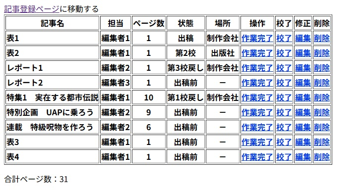

# さくらのレンタルサーバ版の記事制作管理システム
雑誌や書籍の制作管理するシステム（magmanage）のさくらのレンタルサーバ版です。

## 設置方法
MySQLでデータベースを作成して「デーブルの作成」に示した手順でその中にテーブルを作成します。 さくらレンタルサーバの「www」ディレクトリ内に任意のディレクトリを作成し、このソースコードと[PHPMailer](https://github.com/Synchro/PHPMailer.git)を配置してconfig.phpを書き換えれば動作します。セキュリティ対策のため、少なくともトップディレクトリにはベーシック認証を設定してください。

## テーブルの作成
テーブル作成のSQL文。さくらのレンタルサーバの管理画面にある「phpMyAdmin」からデータベース（magmanage_db）を指定して実行します。
```
create table article (
pkey int auto_increment primary key,
valid int,
number int not null,
issue text,
status int,
charge int,
place int,
page int
); 
```
## configファイルの書き換え
さくらのレンタルサーバでメールアドレスを登録しておいてください。少なくとも←を付けた箇所を書き換えてください。第15校まで対応していますが、増やすことは可能です。
```
<?php
    //Database
    $dsn = 'mysql:host=mysqxxxxx.db.sakura.ne.jp;dbname=magmanage_db;charser=utf8'; ← MySQLのホスト名
    $user = 'magmanage_db';
    $password = 'xxxxxxxxxxx';　← データベースへログインするためのパスワード

    //Data
    $status = array('出稿前', '出稿', '第1校', '第1校戻し', '第2校', '第2校戻し', '第3校', '第3校戻し', '第4校', '第4校戻し', '第5校', '第5校戻し', '第6校', '第6校戻し', '第7校', '第7校戻し', '第8校', '第8校戻し', '第9校', '第9校戻し', '第10校', '第10校戻し', '第11校', '第11校戻し', '第12校', '第12校戻し', '第13校', '第13校戻し', '第14校', '第14校戻し', '第15校', '第15校戻し');
    $status_count = count($status) - 1;
    $charge = array('－', '編集者1', '編集者2', '編集者3');　← 編集担当者名
    $charge_count = count($charge) - 1;
    $place = array('－', '制作会社', '出版社');　← それぞれの会社名
    $sum = 0;

    $editor_address = 'editor@example.com';　← 編集者のメールアドレス
    $production_address = 'production@example.com';　← 制作側のメールアドレス
    $magazine = '某マガジン';　← 雑誌名または書籍名
    
    $mail_address = 'notification@?????.sakura.ne.jp';　← さくらのレンタルサーバに登録したメールアドレス　
    $mail_password = 'yyyyyyyyyyyyy';　←　メールアドレスと一緒に設定したパスワード
    $mail_smtp_server = '?????.sakura.ne.jp';　← さくらのレンタルサーバのメールサーバー名
    $mail_smtp_port = '587';
    $mail_secure = 'tls';
?>
```

